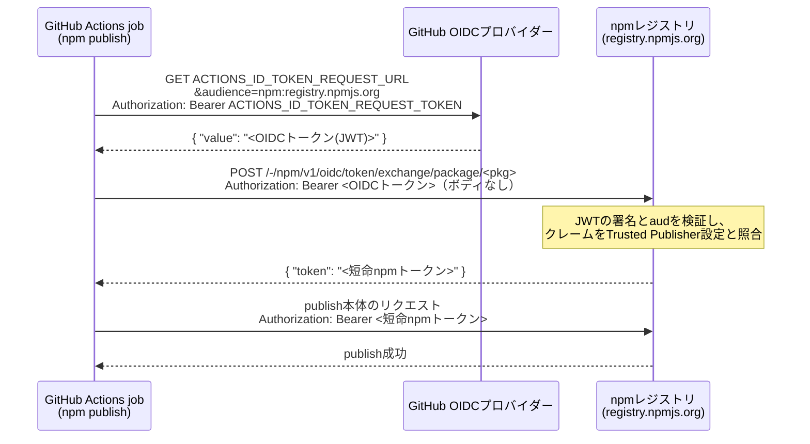

## このブログの内容について
- npm Trusted Publisherの概要と、その利点を説明します。
- 合わせて、半自動ガイドスクリプト（`guide.sh`）が実際に行うnpm/GitHub操作に沿って、npm Trusted Publisherを設定する手順を説明します。

## ブログの内容はいいから、実際にnpm Trusted Publisherでのpublishを試したい方へ

このリポジトリをフォークし、ルートディレクトリで `guide.sh` を実行してください。
未完了のステップを順番に案内してくれます。

```bash
gh repo fork https://github.com/maronnjapan/sample-npm-trusted-package.git --clone=true
cd sample-npm-trusted-package
./guide.sh
```

## 第1章 なぜTrusted Publisherに移行したいのか

### 1-1. はじめに：やりたいことと、避けたいこと

GitHub Actionsからnpmパッケージをpublishする場合、GitHub Secretsに長期のnpm access tokenを配置する運用を避け、Trusted Publisherを利用した移行を検討するケースが増えています。
この記事では、概念の説明にとどまらず、初回publishからGitHub Actionsでのpublishまでを実装ベースで通して解説します。

読者の前提として、npmでのinstall経験があり、GitHub Actionsの存在や基本的な構文を理解している方を想定しています。
最終的なゴールは、ご自身のパッケージで初回publishからTrusted Publisherの設定、GitHub Actionsでのpublishまでの手順を迷わずに実行できるようになることです。

### 1-2. 静的npm tokenをCIに置くリスク

GitHub ActionsなどのCIからnpmパッケージをpublishする際は、npm access tokenを使って認証します。
これはnpmレジストリに対してpublish操作を許可する資格情報で、発行時に設定した有効期間中は使い続けられます。
このtokenをCI/CDのSecretに長期間配置すると、万が一漏洩した場合、有効期間中は継続的に悪用されるリスクが伴います。
例えば、悪意のあるバージョンのパッケージが意図せずpublishされてしまう可能性があります。

こうしたリスクを軽減するため、必要な時にだけ短命のトークンを発行してpublishするアプローチが推奨されています。

*参考: [npm docs: Creating and viewing access tokens](https://docs.npmjs.com/creating-and-viewing-access-tokens)*

### 1-3. Trusted Publisherとは何か

前節で見た「必要な時にだけ短命のトークンを発行する」というアプローチを、npmが仕組み化したものがTrusted Publisherです。
GitHub Actions、GitLab CI、CircleCIのいずれかとnpmの間にあらかじめ信頼関係を構築しておくことで、CI実行時にのみ短命トークンを利用してpublishできるようになります。
事前に静的なnpm tokenを保存しておく方式とは異なり、実行時に必要な権限を持つトークンを動的に取得する点が特徴です。
これにより、GitHub Secretsにnpm tokenを保存する必要がなくなり、セキュリティ上の懸念を軽減できます。

### 1-4. Trusted Publisherによるトークン発行の流れ

Trusted Publisherによるトークン発行の流れは以下の図の通りです。  
この流れは、OIDC（OpenID Connect）というプロトコルのフローと似た流れでIDトークン相当のものを発行します。（※ドキュメントとかにはOIDCだと書いていますが、本当にそれで問題ないのか確信が持てていないので似たものと書いています）  
これは、CIなどのクライアントがIDプロバイダーの発行する署名付きトークンを使って自分の身元を証明するための仕組みで、Trusted PublisherはこれをCIプロバイダーとnpmレジストリの間の信頼関係の確立に利用しています。


ここからは、この流れを一次資料に沿って正確に追います。参照するのは、npm CLIにOIDC publishサポートを追加したPR（[npm/cli#8336](https://github.com/npm/cli/pull/8336)）、そのPRで追加された実装本体（[`lib/utils/oidc.js`](https://github.com/npm/cli/blob/098a26f8c4ac6aa20c0720c9e32dcf02f7b8844e/lib/utils/oidc.js)）、および[npm公式ドキュメント（Trusted publishers）](https://docs.npmjs.com/trusted-publishers)です。

なお、この「CIプロバイダーのOIDCトークンを、レジストリが発行する短命のpublish用トークンへ交換する」という方式はnpm独自の発明ではなく、OpenSSF（Open Source Security Foundation）が[Trusted Publishers for All Package Repositories](https://repos.openssf.org/trusted-publishers-for-all-package-repositories.html)としてまとめている業界標準の実装です。  
この資料には、レジストリ側が行うべき処理（JWTのissuer、署名、audienceの検証 → 事前登録されたトラストポリシーと、JWTに含まれる情報（クレーム）との照合 → 短命APIトークンへの交換）が設計指針として整理されており、PyPIやRubyGemsも同じ方式を採用しています。  
ここでいうトラストポリシーとは、npm側では第5章で登録するOrganization、Repository、Workflow filenameの組み合わせのことです。

PR #8336の本文では、この機能が行うことを次の4ステップで説明しています。

> 1. Detecting when npm is running in a supported CI environment (currently GitHub Actions and GitLab CI)
> 2. Retrieving an OIDC token from the CI provider
> 3. Exchanging this token with the npm registry for a short-lived publishing token
> 4. Using this token for authentication during the publish process

（訳: 1. サポート対象のCI環境で実行されていることを検出する / 2. CIプロバイダーからOIDCトークンを取得する / 3. そのトークンをnpmレジストリで短命のpublish用トークンと交換する / 4. publish処理の認証にそのトークンを使う）

GitHub Actionsの場合に各ステップで実際に何が起きるのかを、`oidc.js`の実装に沿って確認します。

#### ステップ1: CI環境の検出

`npm publish` を実行すると、publishコマンドの処理の中で `oidc.js` が呼ばれます。
ここでは [`ci-info`](https://github.com/watson/ci-info) パッケージを使って、GitHub ActionsまたはGitLab CI上で実行されているかを判定します。
どちらでもない場合（ローカル実行など）はOIDCフローを一切実行せず、従来のトークン認証にそのまま進みます。

#### ステップ2: GitHubのOIDCプロバイダーからOIDCトークン（JWT）を取得

GitHub Actionsのjobに `permissions: id-token: write` が付与されていると、ランナーには次の2つの環境変数が注入されます（[GitHub公式ドキュメント: OIDCリファレンス](https://docs.github.com/en/actions/reference/security/oidc)）。

- `ACTIONS_ID_TOKEN_REQUEST_URL`: GitHubのOIDCプロバイダーにトークンを要求するためのURL
- `ACTIONS_ID_TOKEN_REQUEST_TOKEN`: 上記URLへのリクエストを認証するためのBearerトークン

`oidc.js` はまずこの2つの環境変数が存在するかを確認し、存在しなければ「workflowのid-token権限が不足している」としてOIDCフローをスキップします。
存在すれば、次のHTTPリクエストでOIDCトークンを取得します（`ACTIONS_ID_TOKEN_REQUEST_URL` は元々クエリ文字列を含むURLなので、audienceは `&` で追記されます）。

```
GET {ACTIONS_ID_TOKEN_REQUEST_URL}&audience=npm:registry.npmjs.org
Accept: application/json
Authorization: Bearer {ACTIONS_ID_TOKEN_REQUEST_TOKEN}
```

ポイントは `audience` パラメータです。
`oidc.js` では `npm:${new URL(registry).hostname}` として組み立てられており、既定のレジストリであれば `npm:registry.npmjs.org` になります。
レスポンスはJSONで、その `value` フィールドにOIDCトークンが入っています。
このトークンの実体はJWT（JSON Web Token：JSON形式のデータに署名を付与し、改ざんを検知できるようにしたトークン形式）で、GitHubのOIDCプロバイダーが署名しています。

このJWTのpayloadには、`repository`（owner/repo）、`workflow_ref`（実行中のworkflowファイルのフルパス）、`repository_visibility`（public/private）など、「どのリポジトリのどのworkflowが実行しているか」を表すクレームが含まれています（クレームの一覧は[GitHub公式ドキュメント: About OpenID Connect](https://docs.github.com/en/actions/concepts/security/openid-connect)を参照）。

なお `oidc.js` はこの時点でJWTのpayloadをデコードし、`repository_visibility` が `public` であれば（かつ `--provenance` の指定がユーザーによって明示されていなければ）provenance（パッケージがどのCIワークフローを経てpublishされたかを検証可能な形で記録する仕組み。6-2で扱います）を自動的に有効化します。

この変数がセットされていればGitHub Actions上でもリクエストより優先されます。

#### ステップ3: npmレジストリでのトークン交換

取得したOIDCトークンを使い、npm CLIはnpmレジストリのトークン交換エンドポイントへPOSTします。
PR #8336に記載されているエンドポイント仕様は次の通りです。

> Implement an endpoint at `/-/npm/v1/oidc/token/exchange/package/${escapedPackageName}` that accepts POST requests (no body) with `Authorization` header / `Bearer` set to the `jwt-token-from-ci-provider`.

つまりリクエストは「**ボディなしのPOST + `Authorization: Bearer <OIDCトークン(JWT)>`**」だけです。
レジストリ側はこのJWTを検証（署名と `aud` クレームの確認）した上で、JWTのクレーム（repository / workflowファイル名など）がパッケージに設定済みのTrusted Publisher情報と一致するかを照合し、一致すれば短命のnpmトークンを返します。

```json
{
  "token": "npm_short_lived_token"
}
```

#### ステップ4: 短命トークンでpublish

npm CLIは受け取った短命トークンを `//registry.npmjs.org/:_authToken` としてその場の設定（メモリ上）にセットします。
以降の通常のpublish処理（`publish`コマンド → `libnpmpublish` → `npm-registry-fetch`）はこのトークンで認証されます。
静的なnpm tokenはどこにも登場しません。

全体をシーケンス図にすると以下の通りです。



#### 失敗しても例外を投げない

`oidc.js` のコメントには "This function is intended to never throw"（この関数は決してthrowしないことを意図している）と明記されています。  
OIDCフローの途中で何かが失敗した場合（id-token権限の不足、トークン取得失敗、交換失敗など）、npm CLIは例外を投げずにログを出力するだけで、従来の認証方式にフォールバックします。  
CI上にnpm tokenが無い状態でOIDCフロー失敗すると、匿名ユーザーとしてpublishしようとするため、認証エラーではなく紛らわしい**404**が返ります。
以上概要や実装されたフローについて確認したので、guide.shに記載されている実際のセットアップ手順を確認していきます。

---

## 第2章 今回作るものと、半自動ガイドという方針

### 2-1. 今回作るもの

この記事では、以下について説明します。

- サンプルnpmパッケージの構成
- 初回publishガイド
- Trusted Publisher設定方法
- GitHub Actionsのpublish用workflow作成

これらの作業は、リポジトリに同梱した半自動ガイドスクリプト `guide.sh` を実行すると、ステップごとに案内を受けながら進められます。
以降の章では、`guide.sh` の各ステップが実際に何を行っているかに沿って解説していきます。

### 2-2. 半自動ガイドスクリプト（guide.sh）の使い方

`guide.sh` は以下の2つのモードで実行できます。

| コマンド | 内容 |
|---|---|
| `./guide.sh` | 未完了のステップを順番に案内します（通常はこれで十分です） |
| `./guide.sh reset` | 進捗をリセットします（入力済みの設定値は保持されます） |

進捗と入力値はそれぞれ `.npm-tp-guide-state` / `.npm-tp-guide-config` に保存されるため、途中で中断しても次回実行時に続きから再開できます。
また、`npm login` や `git push` のような実際にnpm/GitHubへ影響するコマンドを実行する前には必ず確認を挟み、断ると「別ターミナルで手動実行してからガイドに戻る」形に切り替えられるため、意図しない操作を防いでいます。

ガイドは以下の7ステップで構成されており、次章以降はこの順番に沿って解説します。

0. 前提チェック
1. npm Organizationの作成
2. package.jsonのname変更
3. 初回publish
4. Trusted Publisherの設定
5. CI（publish.yml）の構築
6. Trusted Publishingの動作確認

以降はguide.shが実際に行っている作業を順に説明したものです。

## 第3章 サンプルパッケージを準備する

### 3-1. リポジトリのフォークと前提条件の確認（Step 0）

まず、このリポジトリをフォークします（クローンではなくフォークするのは、publishやTrusted Publisherの設定においてリポジトリのOwnerが `maronnjapan` ではなく、実際に試すご自身のアカウントである必要があるためです）。
フォークには事前に GitHub CLI で `gh auth login` を済ませておいてください。

```bash
gh repo fork https://github.com/maronnjapan/sample-npm-trusted-package.git --clone=true
cd sample-npm-trusted-package
```

`./guide.sh` を実行すると、Step 0で以下の前提条件を自動的にチェックします。

- gitリポジトリ内で実行しているか
- Node.jsのバージョン（推奨: 22.14.0以上 / 最低: 20.0.0以上）
- npm CLIのバージョン（**11.5.1以上が必須**。Trusted PublisherのOIDC認証に必要）
- GitHub CLI（`gh`）のインストールと認証状態（workflowの手動実行に必要。未認証ならその場で`gh auth login`を促します）
- npmへのログイン状態（未ログインであれば、その場で`npm login`を実行します）

npm CLIが古い場合、ガイドは自動的にアップデートせず、動作確認済みの安定版バージョン（`11.17.0`）をインストールするよう案内して前提チェックを中断します。
`npm i -g npm@11.17.0` はインストール方法の一例であり、バージョン管理ツールなど任意の方法を利用できます。
インストール後に、もう一度 `./guide.sh` を実行してください。
`npm@latest` ではなく指定バージョンを使うのは、CIで使うnpm CLIのバージョンを固定して再現性を保つためです。
実際に2026年7月、`npm@latest`経由で取得したnpm 12.0.0系で `sigstore` の同梱漏れによりpublishが壊れる不具合に遭遇しました（この不具合自体は同月10日リリースのnpm 12.0.1で修正済みです）。
詳しい経緯は記事末尾の補足「Cannot find module 'sigstore'」で扱います。

### 3-2. npm Organizationを作成する（Step 1）

このサンプルでは、パッケージをOrganizationスコープ（`@org名/package名`）でpublishします。
Trusted Publisherを実運用に近い形で試すためにscope付きパッケージを採用しており、そのscopeの前提としてnpm Organizationが必要です。

Organizationの作成はnpmのWeb UIでのみ行えます（CLIからは作成できません）。

1. https://www.npmjs.com/org/create を開きます。
2. Organization名を入力します。この名前がそのままパッケージのscopeになります。
3. 料金プランは「Free（Unlimited public packages）」を選択します。
4. 必要であればメンバーを招待し、「Create」をクリックします。

`guide.sh` はこのステップの最初にOrganization名の入力を求めます。
入力した名前は後続のステップ（package.jsonのname設定やTrusted Publisherの登録）でも再利用されます。

### 3-3. package.jsonのnameを設定する（Step 2）

Organizationを作成したら、`guide.sh` が対話形式で以下を設定します。

- `name` を `@Organization名/パッケージ名` の形式に変更
- `version` が未設定の場合は `0.0.1` を追加（既に設定済みの場合は変更しません）
- `publishConfig.access` を `"public"` に設定

`publishConfig.access: "public"` は、scope付き（`@org/pkg`形式）のパッケージをpublishする際に必要な設定です。
これが無いとscope付きパッケージはデフォルトでprivate publish扱いになりpublishに失敗するため、あらかじめ設定しておくことで、以降`npm publish`実行時に毎回`--access public`を付けなくても済むようになります。

## 第4章 初回publish（Step 3）

### 4-1. 初回publish前に確認すること

Trusted Publisherを設定するには、対象のパッケージが一度npmにpublishされている必要があります。
まずは `package.json` の `name` と `version` が正しく設定されているかを確認します。
また、CLI上で `npm login` が完了しているかも事前に確認してください。
ここが完了していないと、Trusted Publisherの設定へ進むことができません。

`guide.sh` はこれらの確認を自動で行い、`npm login` が未実施であればその場でログインを促してから次に進みます。

### 4-2. 初回publishを実行し、結果を確認する

ターミナルから初回のnpm publishコマンドを実行します。

```bash
npm publish --access public
```

publishが成功したら、`https://www.npmjs.com/package/<name>` にアクセスし、公開されていることを確認します。
確認後、次のTrusted Publisher設定へ進みます。

## 第5章 Trusted Publisherを設定する（Step 4）

### 5-1. npm画面でTrusted Publisherを設定する手順

npmのパッケージ設定ページにアクセスし、Trusted Publisherを設定します。（※以下の項目名は執筆時点のnpm画面に基づいています）

1. `https://www.npmjs.com/package/<name>/access` を開きます（パッケージページの「Settings」タブからでも遷移できます）。
2. 「Trusted Publisher」セクションで、CI/CDプロバイダーに **GitHub Actions** を選択します。
3. 以下の情報を入力します。
   - Organization or user（GitHub owner）
   - Repository（GitHub repository名）
   - Workflow filename（例: `publish.yml`。**パスではなくファイル名のみ**）
4. **Allowed actions** で、このTrusted Publisherに許可する操作を選択します（詳細は次項）。
5. 設定を保存し、Trusted Publisherがリストに追加されたことを確認します。

GitHubのowner/repositoryは、GitHub CLI（`gh`）にログイン済みであれば `gh repo view` から自動取得できます。
`guide.sh` もこれを利用して入力の手間を省いています。

### 5-2. Allowed actionsの選択

Allowed actionsには次の2つの選択肢があり、**少なくとも一方へのチェックが必須**です。

| 選択肢 | 内容 |
|---|---|
| Allow npm publish | `npm publish`によるレジストリへの直接公開を許可します。`--tag`を省略した場合は`latest`へ、指定した場合はそのdist-tag（`latest`のような、特定のバージョンに付けるラベル）へ公開します |
| Allow npm stage publish | 本番へは公開せず、いったん「ステージング」としてアップロードします。公開前にレビューと承認を挟む場合に使います |

本記事は`npm publish`のTrusted Publishingを確認するため、**「Allow npm publish」のみ**にチェックを入れます。
workflowはpatch versionを上げ、通常の`latest` dist-tagへpublishします。
「Allow npm stage publish」は今回使わないため、チェックしません。

## 第6章 GitHub Actionsからnpm tokenなしでpublishする（Step 5）

### 6-1. package.jsonにrepositoryフィールドを設定する

workflowを書く前に、`package.json` に `repository` フィールドを設定しておく必要があります。
`npm publish --provenance` は `repository.url` と実際にpublishを実行しているリポジトリが一致することを検証するため、これが無い（または実際のリポジトリと異なる）場合、CIからのpublishが失敗します。

```bash
npm pkg set repository.type="git" repository.url="https://github.com/<owner>/<repo>"
```

`guide.sh`（Step 5）は、Step 4で入力したowner/repositoryの情報を使ってこれを自動設定します。
情報が無い場合は `gh repo view` からの取得や手入力で補います。

### 6-2. publish用workflowを書く

GitHub Actionsのworkflowを作成します。
`permissions`には、短命トークンの発行に使う`id-token: write`と、version更新のpushに使う`contents: write`を指定します。

```yaml
name: Publish Package

on:
  workflow_dispatch:

jobs:
  publish:
    runs-on: ubuntu-latest
    concurrency:
      group: npm-publish
      cancel-in-progress: false
    permissions:
      contents: write   # publish後のpackage.jsonをcommit・pushするために必要
      id-token: write   # Trusted Publisherの短命トークン発行に必須
    steps:
      - uses: actions/checkout@v4
        with:
          ref: ${{ github.ref_name }}
      - uses: actions/setup-node@v4
        with:
          node-version: '22.x'
          registry-url: 'https://registry.npmjs.org'
      - run: npm install -g npm@11.17.0
      - run: npm version patch --no-git-tag-version
      - run: npm publish --provenance --access public
      - name: Commit version bump
        run: |
          version="$(npm pkg get version | tr -d '"')"
          git config user.name "github-actions[bot]"
          git config user.email "41898282+github-actions[bot]@users.noreply.github.com"
          git add package.json
          if [ -f package-lock.json ]; then git add package-lock.json; fi
          git commit -m "chore: bump package version to ${version}"
          git push
```

この設定により、GitHub Secretsに静的なnpm tokenを保存しなくても動作するようになります。
ポイントを補足します。

- **`workflow_dispatch`**: GitHub Actionsのworkflowを手動実行するトリガーです。
  本記事ではTrusted Publishingの動作確認に集中するため、GitHubのtagやReleaseとは連動させません。
- **`concurrency`**: publish jobを直列化します。
  複数回の手動実行が重なり、同じversionをpublishしようとする競合を避けます。
- **`contents: write`**: publish後に`package.json`をGitHubへcommit・pushするための権限です。
  npmへの認証には使いません。
- **`npm install -g npm@11.17.0`**: Trusted Publisher（OIDC）でのpublishにはnpm CLI 11.5.1以上が必要ですが、`setup-node`が用意するnpmはこれより古いことがあるため、明示的にアップデートします。
  `npm install -g npm@latest` にすると、3-1で触れた通りバージョンが固定されずCIの再現性が下がるため、動作確認済みの安定版バージョンを固定で指定します。
- **`npm version patch --no-git-tag-version`**: `package.json`のpatch versionを一つ上げます。
  `--no-git-tag-version`を指定するため、この段階ではcommitやGitHub tagを作りません。
- **`npm publish --provenance --access public`**: 更新後のversionをTrusted Publishingでnpmへ公開します。
  dist-tagを指定しないため、公開したversionが`latest`になります。
- **`Commit version bump`**: npmへのpublishが成功した後、同じversionの`package.json`をGitHubへcommit・pushします。
  初回publishが`0.0.1`なら、workflow完了後はGitHubとnpmの両方が`0.0.2`になります。
- このサンプルパッケージは依存ゼロのため `npm ci` のようなインストールステップは省いています。
  依存パッケージがある場合はpublishの前に追加してください。

この `publish.yml` はTrusted Publishingを繰り返し確認するための検証用workflowです。
実際のプロジェクトでは、GitHub Releaseの公開、tagのpush、特定ブランチへのmergeなど、採用しているリリース手順に合わせてworkflowの実行タイミングとversionの決め方を調整してください。
保護ブランチへGitHub Actionsから直接pushできないプロジェクトでは、version更新をPull Request経由にするなど、リポジトリのルールに合わせた変更も必要です。

workflowファイルの作成後は、`package.json` の変更とあわせてGitHubにpushします。

```bash
git add .github/workflows/publish.yml package.json
git commit -m "ci: add npm publish workflow and repository field"
git push
```

> **重要**: npmのTrusted Publisherに登録したWorkflow filename（例: `publish.yml`）と、実際に作成したworkflowファイル名は一致している必要があります。

## 第7章 Trusted Publishingの動作確認（Step 6）

CIからのtokenなしpublishを実際に動かして確認します。

### 7-1. publish用workflowを手動実行する

```bash
gh workflow run publish.yml
```

`guide.sh`がStep 6で行うGitHub操作は、このコマンドだけです。  
workflow側でpatch versionを上げるため、ローカルでのversion変更は必要ありません。

### 7-2. publishの成功を確認する

1. GitHubのActions実行ログで、versionの更新、`npm publish --provenance`、version更新commitのpushが成功していることを確認します。
2. GitHub上の`package.json`を開き、versionが`0.0.1`から`0.0.2`へ更新されていることを確認します。
3. `https://www.npmjs.com/package/<name>`を開き、同じ`0.0.2`が`latest`として公開されていることを確認します。

CIが更新するのはGitHub上の`package.json`です。
手元のファイルへ反映する場合は、workflow完了後に`git pull`を実行します。

ここまで確認できれば、GitHub Secretsにnpm tokenを置かずにpublishできる状態が完成です。

---

## （補足）第8章 GitHub側で発行されるOIDCトークンをデバッグする

1-4で見た通り、Trusted Publisherの入り口は「GitHubのOIDCプロバイダーが発行するJWT」です。
npm側に登録したTrusted Publisher設定（Organization or user / Repository / Workflow filename）と照合されるのはこのJWTのクレームなので、`Workflow does not match` 系のエラーや原因不明の404に遭遇したときは、**workflowに実際に渡ってくるJWTの中身を確認する**のが一番の近道です。

[PR #8336](https://github.com/npm/cli/pull/8336)の「For other CLI's」セクションには、npm CLI以外のツールが同じフローを実装するための手順（`ACTIONS_ID_TOKEN_REQUEST_URL` に `npm:registry.hostname` 形式のaudienceを付けてリクエストする）が記載されており、これはそのままデバッグ手順として流用できます。

:::message alert
**パブリックリポジトリでこれらのデバッグを行う前に、必ずお読みください**

パブリックリポジトリのActionsログは**誰でも閲覧できる**ため、生のJWTをログに出力してしまうと、有効期限内であれば第三者がそのJWTをトークン交換エンドポイントに送ってpublish用の短命npmトークンを取得できてしまう可能性があります。
対策を8-4にまとめているので、実行前に必ず確認してください。
以降のサンプルは、生トークンをログに出さない書き方にしてあります。
:::

### 8-1. 方法1: npm CLIと同じリクエストをcurlで再現する

`oidc.js` がステップ2で行っているHTTPリクエストは、workflowのステップ内でcurlを使ってそのまま再現できます。
jobに `id-token: write` 権限が必要な点もnpm CLI本番時と同じです。

```yaml
name: Debug OIDC Token

on: workflow_dispatch

jobs:
  debug-oidc:
    runs-on: ubuntu-latest
    permissions:
      id-token: write
    steps:
      - name: Get OIDC token and decode claims
        run: |
          # npm CLI (oidc.js) と同じリクエストでOIDCトークンを取得する
          response=$(curl -sS \
            -H "Accept: application/json" \
            -H "Authorization: Bearer ${ACTIONS_ID_TOKEN_REQUEST_TOKEN}" \
            "${ACTIONS_ID_TOKEN_REQUEST_URL}&audience=npm:registry.npmjs.org")
          token=$(printf '%s' "$response" | jq -r '.value')

          # 生トークンが以降のログに出ても伏せ字になるよう、真っ先にマスク登録する
          echo "::add-mask::${token}"

          # JWTのpayload部（2番目のセグメント）だけをbase64urlデコードして表示する
          payload=$(printf '%s' "$token" | cut -d '.' -f 2 | tr '_-' '/+')
          while [ $(( ${#payload} % 4 )) -ne 0 ]; do payload="${payload}="; done
          printf '%s' "$payload" | base64 -d | jq .
```

表示しているのはJWTのpayload（クレーム部分）だけです。
署名部を含まないため、この出力だけではトークンとして使用できません。

なお、`Workflow does not match` の調査でクレームを確認したい場合は、この単体workflowではなく**実際のpublish用workflow（`publish.yml`）に上記ステップを一時的に追加**してください。
`workflow_ref` や `sub` などのクレームは「どのworkflowファイルが実行しているか」で値が変わるため、別ファイルのworkflowで取得したトークンでは、publish時に実際に送られる値を確認できません。

### 8-2. 方法2: actions/github-script（core.getIDToken）を使う

`@actions/core` の `getIDToken()` を使う方法もあります。

```yaml
      - name: Get OIDC token via actions/github-script
        uses: actions/github-script@v7
        with:
          script: |
            const token = await core.getIDToken('npm:registry.npmjs.org')
            const payload = JSON.parse(
              Buffer.from(token.split('.')[1], 'base64').toString('utf8')
            )
            core.info(JSON.stringify(payload, null, 2))
```


### 8-3. 確認すべきクレーム

デコードしたpayloadのうち、Trusted Publisherのデバッグで特に見るべきクレームは以下です。

| クレーム | 値の例 | 確認ポイント |
|---|---|---|
| `repository` | `owner/repo` | npm側の「Organization or user」+「Repository」と一致しているか |
| `workflow_ref` | `owner/repo/.github/workflows/publish.yml@refs/heads/main` | ファイル名部分がnpm側の「Workflow filename」と一致しているか |
| `aud` | `npm:registry.npmjs.org` | audienceパラメータで指定した値になっているか |
| `sub` | `repo:owner/repo:ref:refs/heads/main` | どのref（tag/branch/environment）からの実行か |
| `repository_visibility` | `public` / `private` | `public` の場合、npm CLIがprovenanceを自動有効化する（1-4参照） |
| `exp` / `iat` | UNIX時間 | トークンの有効期限と発行時刻 |

たとえばnpm側にWorkflow filenameとして `other-publish.yml` を登録しているのに `workflow_ref` が `.../publish.yml@...` になっていれば、それが不一致の原因です。

### 8-4. パブリックリポジトリでの注意点と対策まとめ

冒頭の警告の通り、パブリックリポジトリではActionsの実行ログが誰でも閲覧でき、かつログはデフォルトで90日間保持されます。
デバッグ時は以下を徹底してください。

1. **生のJWTを絶対にログへ出力しない。**
   表示するのはpayload（クレーム部分）のみにします。
   署名部が無ければトークンとしては機能しません。
   なお、パブリックリポジトリではpayloadの中身（リポジトリ名やworkflowパスなど）はほぼ公開情報のため、クレーム表示自体のリスクは低いでしょう。
2. **トークン取得直後にマスク登録する。**
   curl方式なら `echo "::add-mask::${token}"` を最初に実行します。
   マスクは**登録した以降の出力にしか効かない**ため、順序が重要です。
   `core.getIDToken()` を使う方式なら自動でマスクされます。
3. **`set -x` やステップデバッグを併用しない。**
   トークンを扱うステップでシェルのトレース（`set -x`）や `ACTIONS_STEP_DEBUG` を有効にすると、コマンドライン展開の過程でトークンがログに乗る恐れがあります。
4. **可能ならプライベートリポジトリ（または検証用フォーク）でデバッグする。**
   これが最も確実な対策です。
   プライベートリポジトリのログは、リポジトリへのアクセス権を持つ人しか閲覧できません。
5. **万一、生のJWTを公開ログに出してしまった場合。**
   発行済みのJWT自体を失効させる手段はありません。
   有効期限（`exp`）が切れるまでの悪用を防ぐため、npm側のTrusted Publisher設定を一時的に削除して交換リクエストを失敗させ、あわせて該当のworkflow実行ログを削除します（ただし、削除前に閲覧されたり保存されたりした可能性までは消せません）。
6. **「短命だから漏れても大丈夫」とは考えない。**
   公開ログは実行直後からリアルタイムで閲覧可能なため、有効期限内に悪用される余地があります。

## （補足）実際に試して困ったエラー：Cannot find module 'sigstore'

```
error an error occurred while publishing ～:
MODULE_NOT_FOUND Cannot find module 'sigstore'
```

**要因**：
`npm publish --provenance`（Trusted Publisherの利用時は自動的に有効化されます）の内部で使われる `libnpmpublish` は `sigstore` パッケージに依存していますが、npm 12.0.0（2026年7月8日リリース）ではビルド時のバンドル処理の不具合により、この `sigstore` が配布物（tarball）に同梱されないままリリースされていました。
`npm install -g npm@latest` を実行するとこの12.0.0系を取得してしまい、provenance付きpublishの実行時に上記のエラーで失敗します。
npm/cli issue [#9722](https://github.com/npm/cli/issues/9722) で報告され、2026年7月10日リリースのnpm 12.0.1で修正されています。

**対処**：
`npm@latest` ではなく、この不具合が混入していない安定版を明示的にバージョンピン留めします（今回は `npm@11.17.0` を指定して解消しました）。
不具合自体は修正済みですが、CIで使うnpm CLIのバージョンを固定しておくこと自体は、今回のような不具合に振り回されないための一般的な予防策として引き続き有効です。

**参考**：
- [npm/cli issue #9722: `npm publish` results in `Cannot find module 'sigstore'`](https://github.com/npm/cli/issues/9722)
- [npm/cli releases（正式リリースタグの確認）](https://github.com/npm/cli/releases)

### 最終的な publish.yml の該当部分（要点）

```yaml
- name: Update npm to a pinned stable version
  run: npm install -g npm@11.17.0   # latestではなく明示バージョン指定
```

---

## 第9章 まとめと、今回扱わなかったこと

### 9-1. まとめ

CIに長期tokenを配置する運用のリスクと、それを回避するためのTrusted Publisherの導入手順について解説しました。
初回publishやnpm画面での設定には一部手作業が残りますが、開くURLや入力値を明示した「半自動ガイド」を用いることで、人間が迷わずに作業でき、AIの支援も受けやすくなります。

### 9-2. 今回扱わなかったこと

この記事ではスコープ外とした以下のトピックについては、Trusted Publisherによるpublishの基本が整った後に、次のステップとして検討してください。

- version（patch/minor/major）の決定やChangelogの自動生成
- GitHub Release、tag、Releaseブランチなど、各プロジェクトのリリース手順との連携
- パッケージ自体のより高度な設計

## 参考資料

### 一次資料（トークン取得フローとデバッグ関連）
- [npm/cli PR #8336: feat: adds support for oidc publish（OIDC publishの初期実装。フローとエンドポイント仕様の出典）](https://github.com/npm/cli/pull/8336)
- [npm/cli lib/utils/oidc.js（PR #8336時点の実装本体）](https://github.com/npm/cli/blob/098a26f8c4ac6aa20c0720c9e32dcf02f7b8844e/lib/utils/oidc.js)
- [npm docs: Trusted publishers](https://docs.npmjs.com/trusted-publishers/)
- [OpenSSF: Trusted Publishers for All Package Repositories（Trusted Publishing方式の業界標準ガイド。レジストリ側の検証とトークン交換フローの設計指針）](https://repos.openssf.org/trusted-publishers-for-all-package-repositories.html)
- [GitHub Changelog: npm trusted publishing with OIDC is generally available（2025年7月31日のGA発表）](https://github.blog/changelog/2025-07-31-npm-trusted-publishing-with-oidc-is-generally-available/)
- [GitHub Docs: About OpenID Connect（OIDCトークンのクレーム一覧）](https://docs.github.com/en/actions/concepts/security/openid-connect)
- [GitHub Docs: OIDCリファレンス（ACTIONS_ID_TOKEN_REQUEST_URL等の環境変数とcurl例）](https://docs.github.com/en/actions/reference/security/oidc)
- [actions/toolkit: oidc-utils.ts（getIDToken()がsetSecret()で自動マスクする実装）](https://github.com/actions/toolkit/blob/main/packages/core/src/oidc-utils.ts)

### その他
- [npm docs: Creating and viewing access tokens](https://docs.npmjs.com/creating-and-viewing-access-tokens)
- [npm docs: Generating provenance statements](https://docs.npmjs.com/generating-provenance-statements)
- [GitHub Actions docs: Publishing Node.js packages](https://docs.github.com/en/actions/publishing-packages/publishing-nodejs-packages)
- [GitHub Actions docs: Control the concurrency of workflows and jobs](https://docs.github.com/en/actions/how-tos/write-workflows/choose-when-workflows-run/control-workflow-concurrency)
- [GitHub Actions docs: Workflow syntax for permissions](https://docs.github.com/en/actions/reference/workflows-and-actions/workflow-syntax#jobsjob_idpermissions)
- [npm/cli issue #9722: `npm publish`実行時に`sigstore`が見つからずpublishが壊れる不具合（2026年7月10日リリースのnpm 12.0.1で修正済み）](https://github.com/npm/cli/issues/9722)
